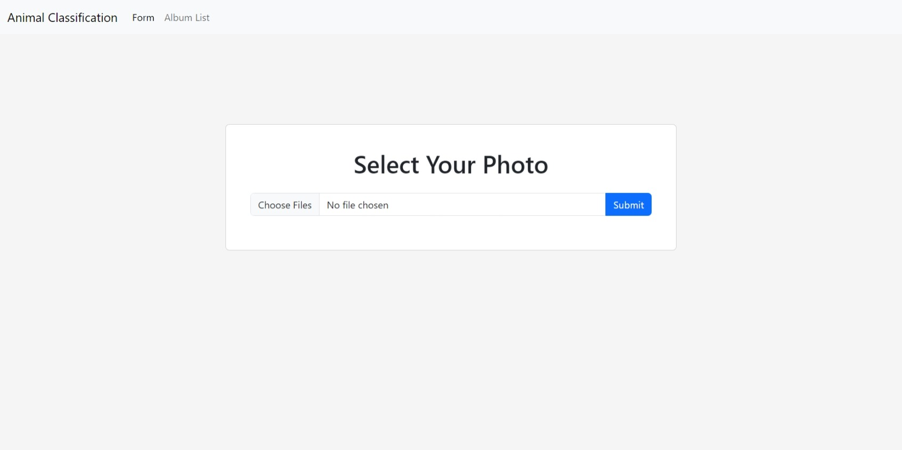

# Machine Learning Animal Classification

## Cara Menjalankan
1. Buka Terminal (Command Prompt) & Ubah Working Directory ke Lokasi yang Anda Inginkan untuk Menyimpan Hasil Clone.
2. Clone Repository ke Local Computer Menggunakan Command "*git clone (url repository)*" & Tunggu Proses Selesai.
3. Ubah Working Directory ke Folder Project Hasil Clone dengan command "*cd Deep_Learning_Animal_Classification*"
4. Install Semua Requirements yang Dibutuhkan untuk Menjalankan Project Menggunakan Command "*pip install -r requirements.txt*"
5. Download Model CNN Melalui Link Berikut : [OneDrive](https://mikroskilacid-my.sharepoint.com/:u:/g/personal/211111669_students_mikroskil_ac_id/ERiMQyjMXPlNkQ07Bx2U5GMBfdHY674ta0CXASfpv2NxWQ?e=FbSJVv)
6. Pindahkan Model CNN yang Telah Didownload ke Folder Project
   .png)
7. Kembali ke Command Prompt pada Working Directory "Deep_Learning_Animal_Classification" & Jalankan Program dengan Menggunakan Command "*python app.py*"
8. Program dapat Diakses pada [localhost:5000](http://localhost:5000)
   
9. Untuk Menghentikan Program dapat Dilakukan dengan Mengetikkan *ctrl + c* pada Command Prompt
